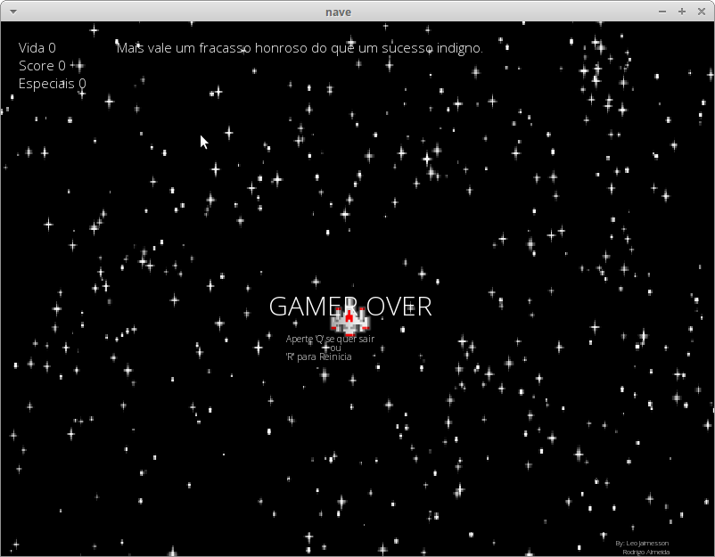

# Space

Projeto implementado na disciplina de Fundamentos de Programação da Universidade Federal do Ceará campus Quixadá.




## Instalar Dependências

O projeto necessita da seguinte bibliotecas:

> libcsfml-dev

```terminal
sudo apt-get install libcsfml-dev
```

## Criar Executável

**Compilar no terminal:**

> Dentro da pasta src execute o comando abaixo:

```terminal
gcc main.c personagens.c cenario.c csfml.c -lcsfml-graphics -lcsfml-audio -lcsfml-window -lcsfml-system -o space
```

## Iniciar Jogo

**Executar no terminal:** 

> Dentro da pasta src execute o comando abaixo:

```terminal
./space
```

## Jogabilidade

>W = Move a nave para cima.
>S = Move a nave para baixo.
>A = Move a nave para a esquerda.
>S = Move a nave para a direita.
>ESPAÇO = Dispara balas contra as naves inimigas.
>K = Solta um especial se já houver algum no contador.
